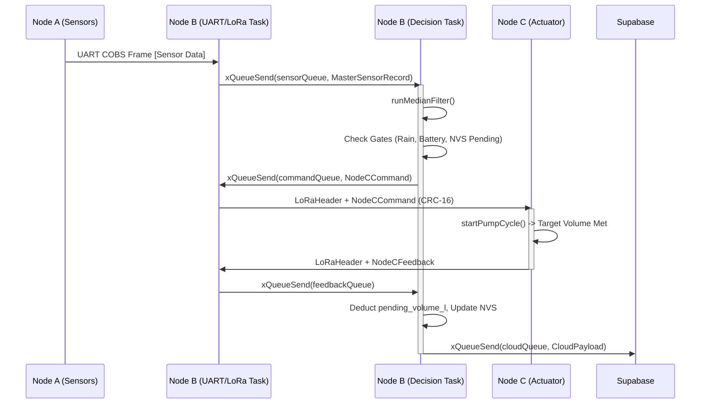

# SYSTEM ARCHITECTURE DEEP DIVE: AgroSmart Enterprise IoT
**Confidential Codebase Audit & Technical Specification**

---

## 1. Node-by-Node Anatomic Breakdown

### 1.1 Node A (Edge Sensor)
**Location:** `C:\Users\abhishek kumar thaku\OneDrive\Documents\Arduino\Agrosmart_NodeA`

Node A operates as a strict sensory ingest node. It samples environmental metrics via hardwired interfaces and dispatches telemetry without retaining state.

**File & Module Inventory**
- **[Agrosmart_NodeA.ino](file:///C:/Users/abhishek%20kumar%20thaku/OneDrive/Documents/Arduino/Agrosmart_NodeA/Agrosmart_NodeA.ino)**
  - `setup()` (L89): Initializes GPIOs, serial peripherals, and boot indicators.
  - `loop()` (L121): Time-slotted execution of sensor polling.
  - `runCycle()` (L27): Invokes Modbus reads and triggers LoRa transmissions.
- **[crc16.h](file:///C:/Users/abhishek%20kumar%20thaku/OneDrive/Documents/Arduino/Agrosmart_NodeA/crc16.h)**
  - `crc16Modbus(const uint8_t *data, size_t len)` (L5): Implements CRC-16 (Modbus polynomial `0xA001`) for data integrity.
- **[enums.h](file:///C:/Users/abhishek%20kumar%20thaku/OneDrive/Documents/Arduino/Agrosmart_NodeA/enums.h)**
  - `SystemState` (L9), `ErrorSeverity` (L35), `PacketType` (L72). Defines states like `STATE_WAIT_DATA`, `STATE_VALIDATE`.
- **[leds.cpp](file:///C:/Users/abhishek%20kumar%20thaku/OneDrive/Documents/Arduino/Agrosmart_NodeA/leds.cpp)**
  - `ledInit()` (L4), `ledAllOff()` (L12), `ledSet(uint8_t pin, bool on)` (L19), `ledPulse(uint8_t pin, uint16_t ms)` (L23), `ledBootRipple()` (L31), `ledShowFault(bool sensorFault, bool txFault)` (L42). UI state handlers.
- **[lora_comms.cpp](file:///C:/Users/abhishek%20kumar%20thaku/OneDrive/Documents/Arduino/Agrosmart_NodeA/lora_comms.cpp)**
  - `initLora()` (L12), `loraIsReady()` (L35).
  - `transmitPacket(const MasterSensorRecord &record)` (L39): Serializes the `MasterSensorRecord` struct, appends `LoRaHeader` and CRC-16, and fires via SX1278 SPI interface.
- **[lora_protocol.h](file:///C:/Users/abhishek%20kumar%20thaku/OneDrive/Documents/Arduino/Agrosmart_NodeA/lora_protocol.h)**
  - `LoRaHeader` (L43), `LoRaSensorPacket` (L73). Memory representations of over-the-air packets.
- **[modbus_core.cpp](file:///C:/Users/abhishek%20kumar%20thaku/OneDrive/Documents/Arduino/Agrosmart_NodeA/modbus_core.cpp)**
  - `rs485Tx()` (L10), `rs485Rx()` (L12), `initModbus()` (L13).
  - `modbusRead(uint8_t addr, uint16_t startReg, uint8_t count, uint16_t *out)` (L21): Blocking UART/RS485 sequence.
  - `readSoilSensor(MasterSensorRecord &r)` (L62): Parses 7-in-1 Soil Sensor registers (Temp, VWC, EC, pH, N, P, K).
- **[structs.h](file:///C:/Users/abhishek%20kumar%20thaku/OneDrive/Documents/Arduino/Agrosmart_NodeA/structs.h)**
  - `MasterSensorRecord` (L31): Fixed-width binary struct matching Node B.

---

### 1.2 Node B (Central Gateway - Core Focus)
**Location:** `C:\Users\abhishek kumar thaku\OneDrive\Documents\Arduino\Agrosmart_nodeB`

Node B acts as the system\'s asymmetric multiprocessing brain (ESP32-WROOM-32U running FreeRTOS). It merges Node A\'s UART/LoRa ingest with local I2C telemetry, calculates the FAO-56 Penman-Monteith deficit, commands Node C, and syncs with the Supabase Cloud.

**File & Module Inventory**
- **[Agrosmart_nodeB.ino](file:///C:/Users/abhishek%20kumar%20thaku/OneDrive/Documents/Arduino/Agrosmart_nodeB/Agrosmart_nodeB.ino)**
  - `setup()` (L75): Initializes all FreeRTOS Queues, SPI/I2C buses, and spawns asymmetric tasks pinned to Core 0 (`vCloudTask`, `vHealthTask`) and Core 1 (`vSdTask`, `vLoraTask`, `vDecisionTask`, `vUartTask`).
- **[cloud_task.cpp](file:///C:/Users/abhishek%20kumar%20thaku/OneDrive/Documents/Arduino/Agrosmart_nodeB/cloud_task.cpp)**
  - `vCloudTask(void* pvParameters)` (L75): Blocks on `cloudQueue` and `logQueue`. Stack-allocates JSON for idempotency to avoid Heap fragmentation.
  - `postJson(const char* endpoint, const char* body)` (L194): Dispatches Supabase REST POSTs utilizing `Prefer: return=minimal,resolution=ignore-duplicates`.
- **[config_manager.cpp](file:///C:/Users/abhishek%20kumar%20thaku/OneDrive/Documents/Arduino/Agrosmart_nodeB/config_manager.cpp)**
  - `loadProfileFromSD(FarmProfile* p)` (L49): Parses INI/JSON configurations mapping crop ID, Root Depth, FC, WP, and MAD.
- **[decision_task.cpp](file:///C:/Users/abhishek%20kumar%20thaku/OneDrive/Documents/Arduino/Agrosmart_nodeB/decision_task.cpp)** *(The FAO-56 Brain)*
  - `nvsSavePending(float val)` (L40), `nvsLoadPending()` (L49): Non-Volatile Storage recovery of partial irrigation volumes (`pending_volume_l`) during unexpected reboots.
  - `runMedianFilter(float value)` (L91): 5-sample circular filter to dampen VWC sensor noise.
  - `vDecisionTask(void *pvParameters)` (L139): The agronomic FSM. Pops from `feedbackQueue` first to deduct `delivered_volume_l` from `pending_volume_l`. Assesses limits against `MasterSensorRecord`.
- **[environment_task.cpp](file:///C:/Users/abhishek%20kumar%20thaku/OneDrive/Documents/Arduino/Agrosmart_nodeB/environment_task.cpp)**
  - `injectEnvironmentData(...)` (L119): Ingests I2C BMP280/SEN0575 data and fuses it into the `MasterSensorRecord`.
- **[health_task.cpp](file:///C:/Users/abhishek%20kumar%20thaku/OneDrive/Documents/Arduino/Agrosmart_nodeB/health_task.cpp)**
  - `vHealthTask(...)` (L347): Monitors `heap_caps_get_largest_free_block()`. Asserts `isNodeCBatteryOk()` (L328) gate. Triggers `controlledReboot(uint8_t reason)` (L205) on memory exhaustion.
- **[led_task.cpp](file:///C:/Users/abhishek%20kumar%20thaku/OneDrive/Documents/Arduino/Agrosmart_nodeB/led_task.cpp)**
  - Manipulates an I2C PCA9685 PWM driver for localized status indications.
- **[lora_task.cpp](file:///C:/Users/abhishek%20kumar%20thaku/OneDrive/Documents/Arduino/Agrosmart_nodeB/lora_task.cpp)**
  - `transmitCommand(const NodeCCommand &cmd, uint16_t &seqCounter)` (L214): Manages SX1278 VSPI asynchronously. Sends `PACKET_IRRIGATION_COMMAND` and awaits `PACKET_IRRIGATION_COMPLETE`.
- **[sd_task.cpp](file:///C:/Users/abhishek%20kumar%20thaku/OneDrive/Documents/Arduino/Agrosmart_nodeB/sd_task.cpp)**
  - `vSdTask(...)` (L445): Mounts FAT32. Pulls from `sdQueue`, `sdLogQueue`, `irrigationLogQueue` to append `.csv` matrices. Utilizes `openForAppend` (L170).
- **[srijan_security.cpp](file:///C:/Users/abhishek%20kumar%20thaku/OneDrive/Documents/Arduino/Agrosmart_nodeB/srijan_security.cpp)**
  - Cryptographic layer utilizing AES-128-GCM (`srijan_seal`, `srijan_open`) for payload obfuscation over RF.
- **[uart_task.cpp](file:///C:/Users/abhishek%20kumar%20thaku/OneDrive/Documents/Arduino/Agrosmart_nodeB/uart_task.cpp)**
  - Ingests Node A byte streams, un-COBS, checks CRC-8, pushes to `sensorQueue`.
- **[structs.h](file:///C:/Users/abhishek%20kumar%20thaku/OneDrive/Documents/Arduino/Agrosmart_nodeB/structs.h)** & **[enums.h](file:///C:/Users/abhishek%20kumar%20thaku/OneDrive/Documents/Arduino/Agrosmart_nodeB/enums.h)** & **[queues.h](file:///C:/Users/abhishek%20kumar%20thaku/OneDrive/Documents/Arduino/Agrosmart_nodeB/queues.h)**
  - Define exact data limits (`__attribute__((packed))`), FreeRTOS IPC channels, and discrete state vectors (e.g., `REASON_RAIN_LOCK`).

---

### 1.3 Node C (Actuator)
**Location:** `C:\Users\abhishek kumar thaku\OneDrive\Documents\Arduino\Agrosmart_NodeC`

Node C executes localized commands, measuring physical throughput and enforcing electrical hardware safety. It possesses no autonomous agronomic intelligence.

**File & Module Inventory**
- **[actuators.cpp](file:///C:/Users/abhishek%20kumar%20thaku/OneDrive/Documents/Arduino/Agrosmart_NodeC/actuators.cpp)**
  - `onFlowPulse()` (L34): YF-S201 hardware interrupt (GPIO 34, `FALLING`).
  - `readCurrentA()` (L105): Reads ACS712 analog input for motor stall detection.
  - `startPumpCycle(const NodeCCommand &cmd)` (L189): Implements a non-blocking internal FSM (`VALVE_OPENING` -> `PUMP_RUNNING` -> `VALVE_CLOSING`) reliant entirely on `millis()`.
  - `emergencyStop()` (L236): Hardkill relay override.
- **[comms.cpp](file:///C:/Users/abhishek%20kumar%20thaku/OneDrive/Documents/Arduino/Agrosmart_NodeC/comms.cpp)**
  - `handleIncomingPacket(int packetSize)` (L139): Intercepts `LoRaCommandPacket`. Checks `FLAG_EMERGENCY`. Defers valid commands to `startPumpCycle()`.
  - `sendFeedback(...)` (L56): Transmits `LoRaFeedbackPacket` populated with `delivered_volume_l`.
- **[diagnostics.cpp](file:///C:/Users/abhishek%20kumar%20thaku/OneDrive/Documents/Arduino/Agrosmart_NodeC/diagnostics.cpp)**
  - `getRebootCount()` (L65): Diagnostic tracking for brown-out analysis.
- **[sensors.cpp](file:///C:/Users/abhishek%20kumar%20thaku/OneDrive/Documents/Arduino/Agrosmart_NodeC/sensors.cpp)**
  - `readBatteryVoltage()` (L44): Monitors the INA219 via I2C for the `LoRaHeartbeatPacket`.

---

## 2. Node B Micro-Architecture & Engineering Philosophy

### 2.1 Problem & Gap Analysis
Node B bridges the gap between deterministic real-time hardware execution (irrigation solenoid control) and non-deterministic cloud/network latency (Supabase REST APIs). A single-threaded Arduino paradigm would result in blocked pump commands while waiting on a 400ms HTTP POST or dropped UART ingest bytes during a LoRa transmit window. 

To solve this, Node B is partitioned using Asymmetric Multiprocessing (AMP) via FreeRTOS:
- **Core 0 (Non-Deterministic):** Networking (`vCloudTask`), Wi-Fi stack, and Diagnostics (`vHealthTask`).
- **Core 1 (Deterministic):** Hardware interfaces (`vLoraTask`, `vUartTask`), FAT32 Logging (`vSdTask`), and the Agronomic Brain (`vDecisionTask`).

### 2.2 Algorithmic & Design Mechanics
#### FAO-56 Penman-Monteith Mathematics (`vDecisionTask`)
Node B strictly applies physics-based limits to soil volumetric water capacity:

Total Available Water ($TAW$):
$$ TAW_{mm} = (FC - WP) \times RootDepth_m \times 1000 $$

Readily Available Water ($RAW$):
$$ RAW_{mm} = TAW_{mm} \times MAD_{percent} $$

Water Deficit ($Deficit$):
$$ Deficit_{mm} = \max(0, (FC - VWC) \times RootDepth_m \times 1000) $$

Vapor Pressure Deficit ($VPD$):
$$ e_{s,kPa} = 0.6108 \times e^{\left(\frac{17.27 \times T_{air}}{T_{air} + 237.3}\right)} $$
$$ VPD_{kPa} = e_{s,kPa} \times \left(1 - \frac{RH}{100}\right) $$

**Design Pattern: Pipeline FSM.**
The `vDecisionTask` functions as a stateless gate-checker. It executes a strict cascading logic block (Gate A: Rain lock -> Gate B: Stabilization delay -> Gate C: Daily Volume -> Gate D: Deficit Threshold). This prevents nested `if-else` race conditions. 

### 2.3 Edge Cases & Race Conditions
- **Queue Backpressure (FMEA Discard Policies):** Inter-task communication traverses `queues.h`. `commandQueue` and `feedbackQueue` (P0 Priority) never discard items, blocking the sender. `sensorQueue` (P1 Priority) discards the *oldest* item to preserve real-time recency. `logQueue` (P3 Priority) discards immediately to prevent Heap starvation.
- **Mid-Irrigation Power Cut:** `vDecisionTask` pushes `pending_volume_l` to the internal Flash (NVS) *before* queueing a LoRa command. On boot, `pending_volume_l` is loaded, ensuring that an interrupted Node C pump run does not reset the node's daily limit tracking.
- **Heap Fragmentation (`LoadProhibited` Panics):** JSON construction in `vCloudTask` utilizes deterministic stack allocation (`StaticJsonDocument`) instead of heap allocation to prevent runtime fragmentation crashes after days of operation.

---

## 3. End-to-End Finite State Machine (FSM)

### 3.1 State Transition Matrix
| Source Node | Current State | Trigger Event / Signal | Target State | Destination Node |
| :--- | :--- | :--- | :--- | :--- |
| **Node A** | `STATE_WAIT_DATA` | Modbus poll timer expires | `STATE_SEND_COMMAND` | **Node B** |
| **Node B** | `STATE_WAIT_DATA` | `sensorQueue` ingress > 0 | `STATE_VALIDATE` | **Node B** |
| **Node B** | `STATE_VALIDATE` | All Health Flags = `0x00` | `STATE_DECISION` | **Node B** |
| **Node B** | `STATE_DECISION` | Deficit > (RAW + Margin) & Gates clear | `STATE_SEND_COMMAND` | **Node C** |
| **Node C** | `IDLE` | Rx `PACKET_IRRIGATION_COMMAND` | `VALVE_OPENING` | **Node C** |
| **Node C** | `VALVE_OPENING` | 1500ms pre-charge elapsed | `PUMP_RUNNING` | **Node C** |
| **Node C** | `PUMP_RUNNING` | Target volume reached (Flow Meter) | `VALVE_CLOSING` | **Node C** |
| **Node C** | `VALVE_CLOSING` | 2000ms pressure bleed elapsed | `IDLE` | **Node B** (via ACK) |
| **Node B** | `STATE_WAIT_FEEDBACK`| Rx `PACKET_IRRIGATION_COMPLETE` | `STATE_LOG_RECORD` | **Node B** |

### 3.2 Payload Life-Cycle Sequence

### 3.3 Inter-Node Protocols & Contracts
- **Serialization:** Strict `__attribute__((packed))` binary structs in `structs.h` ensuring no byte-padding compiler mismatches across ESP32 architectures. 
- **Integrity Validation:** Every wireless payload utilizes `LoRaHeader` encapsulation (size, magic byte `0x53`, sender ID, receiver ID, packet type) followed by the struct, terminated with `crc16Modbus`.
- **Timing Epoch:** Node A provides real-time clock via NEO-M8N GPS. Node B syncs this `timestamp_epoch` throughout the system.

---

## 4. Operational Context & Future Roadmap

### 4.1 Contemporary System Viability
The system is highly viable for enterprise deployment due to:
- **Hardware Isolation:** Opto-isolated relay triggers and flyback diodes (1N4007) on Node C to prevent inductive spikes from resetting the ESP32.
- **Data Fidelity:** Dual-write queue topology guarantees that every `IrrigationDecision` is dispatched to both FAT32 (`vSdTask`) and Cloud (`vCloudTask`).
- **Cryptographic Readiness:** The `srijan_security.cpp` layer already implements AES-128-GCM hooks for payload encryption, securing the wireless transport against spoofed `PACKET_IRRIGATION_COMMAND` frames.

### 4.2 Future Refactoring & Scalability Vectors
1. **Dynamic Calibration Provisioning (Node C):** Currently, the `PULSES_PER_LITER` (K-factor) is a compile-time define in Node C. The architecture requires a new `PACKET_CALIBRATE` LoRa type to allow Node B to remotely tune Node C's NVS without firmware reflashing (refer to `AgroTerm_Architecture.md:L150-L162`).
2. **Unified Terminal Architecture:** Migrate serial diagnostics to the proposed "AgroTerm" architecture. The packet dispatchers in `comms.cpp` on Node C must be refactored to treat `SerialTransport` and `LoRaTransport` as equal injection vectors for identically framed structs.
3. **Multi-Zone Expansion:** Node B's logic heavily favors `activeProfile.default_zone_id`. FSM adjustments are required to schedule concurrent or interleaved multi-zone irrigation vectors dynamically. 
4. **Cloud Pagination & Bulk Sync:** Expand `vCloudTask` to drain multi-record SD logs sequentially after extended Wi-Fi outages to prevent HTTP timeouts.
